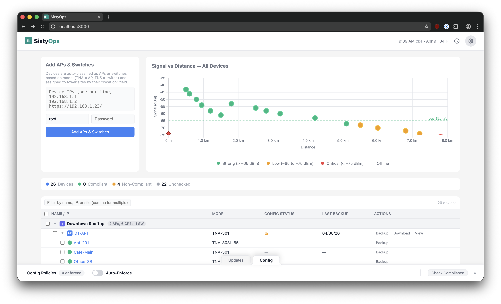
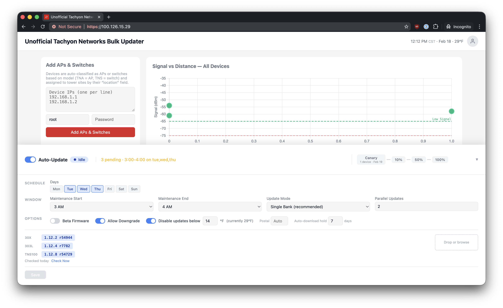

# SixtyOps Manager

Automated firmware updates for Tachyon wireless networks — handles scheduling, gradual rollouts, and safety checks so you don't have to update APs manually.

A firmware cycle means logging into each AP and every attached CPE, uploading the image, selecting the right bank, and waiting for the reboot. One device at a time. In the middle of the night. With hundreds of devices across dozens of sites, it's a lot of work — and it tends to get skipped. SixtyOps handles it automatically: set a maintenance window, assign firmware, and the system updates your fleet over 4 consecutive nights with safety checks at each step. Setup takes 15 minutes.





## How It Works

1. Upload firmware files and configure a maintenance window (e.g., Sundays 2–6 AM)
2. Enable the scheduler
3. Optionally pin test APs and switches as dedicated canaries in the firmware drawer
4. The system rolls out updates over 4 consecutive maintenance windows:
   - Window 1: Canary APs (+ attached CPEs) and canary switches
   - Window 2: 10% of remaining APs and switches
   - Window 3: 50% of remaining APs and switches
   - Window 4: All remaining APs and switches

Any failure pauses the rollout. Review the failed devices and resume when ready.

## Safety Mechanisms

- **Temperature validation** — Blocks updates if temperature is below threshold (default -10°C / 14°F)
- **System time validation** — Blocks updates if AP clock is unreliable (prevents boot loops)
- **Gradual rollout** — Updates canary APs/switches first, then 10%, 50%, 100% on consecutive windows
- **Manual canary run** — The pending Canary pill can run the test phase outside the normal maintenance window
- **Automatic pause on failure** — Any failed update stops the rollout for manual review
- **Maintenance windows** — Updates only run on specified days and times
- **Dry-run mode** — Preview what would be updated before enabling the scheduler

## Supported Devices

**Tachyon Networks**: TNA-301, TNA-302, TNA-303x, TNA-303L, TNA-303L-65, TNS-100

## Additional Features

- **Manual updates** — Immediate updates for specific APs when needed
- **Network topology view** — Visual map of tower sites, APs, and CPEs with signal health indicators
- **Parallel updates** — Configurable concurrency for faster bulk updates
- **Built-in RADIUS** — Integrated RADIUS server for AP and switch admin authentication
- **SFTP backups** — Automated backup of database and device configurations
- **Real-time progress** — WebSocket-based live update status

## Quick Start

Both options below include a bundled nginx reverse proxy with automatic HTTPS — self-signed out of the box, with Let's Encrypt available via the setup wizard.

### Production Deployment

```bash
curl -sSL https://raw.githubusercontent.com/sixtyops/manager/main/scripts/install.sh | sudo bash
```

Installs Docker, configures HTTPS, generates credentials, and starts the system.

Visit `https://your-server` to complete the setup wizard:
1. Change default password
2. Configure Let's Encrypt (optional)
3. Configure SFTP backups (optional)

### Local Testing

```bash
git clone https://github.com/sixtyops/manager.git
cd manager
./deploy.sh
```

Access at `https://localhost` (accept self-signed certificate).

### Behind Your Own Reverse Proxy

```bash
docker compose up -d --build
```

The app listens on port 8000. The bundled nginx is included but has no published ports — your proxy forwards directly to `localhost:8000`. To expose nginx on custom ports instead (e.g., for the built-in SSL management), add a `docker-compose.override.yml`.

See [docs/deployment.md](docs/deployment.md) for full deployment options.

## Usage

### Automatic Updates

1. Upload firmware files (**Firmware** tab)
2. Configure scheduler (**Auto-Update** tab):
   - Set maintenance window (days and time range)
   - Assign firmware to device models
   - Set temperature threshold (default: -10°C / 14°F)
   - Enable scheduler

The system runs the gradual rollout automatically. Check **Rollout Status** to monitor progress. If you have a lab AP or switch, pin it as a canary in the firmware drawer. You can also click the pending `Canary` pill to run that test phase before the maintenance window opens.

See [docs/gradual-rollout.md](docs/gradual-rollout.md) for rollout details.

### Manual Updates

1. Upload firmware (**Firmware** tab)
2. Enter IP addresses (**Update** tab)
3. Configure concurrency and bank mode
4. Start update and monitor progress

Useful for emergency updates, testing new firmware, or updating specific sites outside the schedule.

### Network Monitoring

The **Monitor** page displays network topology (tower sites → APs → CPEs) with signal health indicators. Background polling keeps data current.

## Documentation

- **[Deployment Guide](docs/deployment.md)** — HTTPS, built-in RADIUS, environment variables
- **[RADIUS Guide](docs/radius.md)** — Built-in FreeRADIUS setup, client overrides, and device rollout workflow
- **[Gradual Rollout](docs/gradual-rollout.md)** — How the 4-window rollout works
- **[Release System](docs/release-system.md)** — Release channels, versioning, and self-update behavior
- **[API Reference](docs/api.md)** — REST endpoints and WebSocket protocol
- **[Architecture](docs/architecture.md)** — System design and data flow

## API Integration

Key endpoints for automation and monitoring:
- `POST /api/start-update` — Trigger manual update
- `GET /api/scheduler/status` — Check scheduler state
- `GET /api/rollout/current` — Get rollout progress
- `WebSocket /ws` — Real-time updates

Full API docs: [docs/api.md](docs/api.md)

## For Developers

```bash
# Local dev with auto-reload
uvicorn updater.app:app --reload --port 8000

# Run tests
pytest -v
```

## Development Workflow

All work happens on feature branches off `main`:

### Contributing

1. Create a feature branch from `main`
2. Make changes and run tests (`pytest -v`)
3. Open a PR targeting `main`
4. After merge, tag a dev or stable release as needed

### Release Channels

The app supports two self-update channels (Settings > Updates):
- **Stable** (default) — Only tagged stable releases
- **Dev** — Includes pre-releases for early testing

## License

[Elastic License 2.0 (ELv2)](LICENSE) — free to use and modify, but you may not offer it as a managed service or repackage it for sale.
