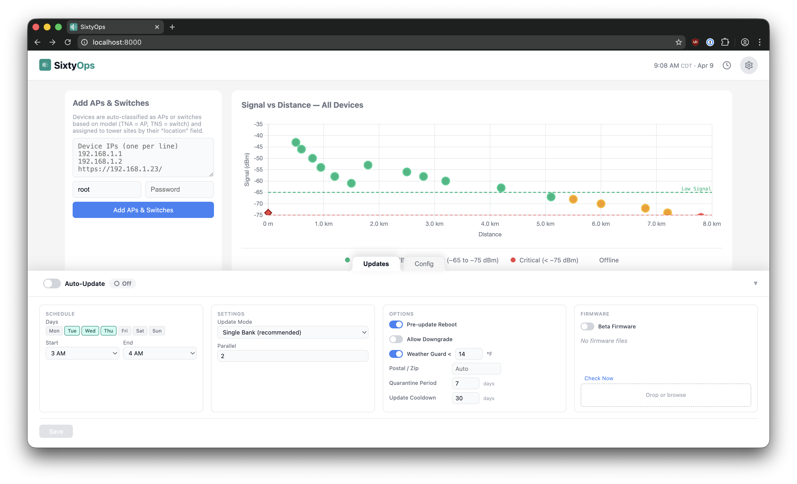

# SixtyOps Manager

Automated firmware updates for Tachyon wireless networks — handles scheduling, gradual rollouts, and safety checks so you don't have to update APs manually.

A firmware cycle means logging into each AP and every attached CPE, uploading the image, selecting the right bank, and waiting for the reboot. One device at a time. In the middle of the night. With hundreds of devices across dozens of sites, it's a lot of work — and it tends to get skipped. SixtyOps handles it automatically: add your APs once with credentials, set a maintenance window, and the system updates your fleet over 4 consecutive nights with safety checks at each step. Setup takes 15 minutes.




## How It Works

1. Add APs and switches (top left) — the system discovers CPEs attached to each AP and assigns devices to tower sites based on the AP's location field
2. Upload firmware files via the **Firmware** tab
3. Configure the scheduler in the **Auto-Update** tab:
   - Set your maintenance window (e.g., Sunday 2–6 AM)
   - Assign firmware images to device models
   - Set safety thresholds (temperature, timezone)
4. The system automatically rolls out updates over 4 consecutive nights:
   - Night 1: Canary APs (+ attached CPEs) and canary switches
   - Night 2: 10% of remaining APs and switches
   - Night 3: 50% of remaining APs and switches
   - Night 4: All remaining APs and switches

Any failure pauses the rollout. Review the failed devices in the rollout status panel and resume when ready.

You can also trigger immediate updates on any single AP, CPE, or switch from the device table's **Update** column without affecting the scheduled rollout.

## Safety Mechanisms

- **Temperature validation** — Blocks updates if temperature is below threshold (default -10°C / 14°F) to protect equipment in cold conditions
- **Timezone validation** — Prevents daytime updates that would cause outages due to device clock drift
- **Gradual rollout** — Updates canary devices first, then progressively larger groups on consecutive nights
- **Manual canary run** — Click the pending Canary pill to test firmware on canary devices before the maintenance window
- **Automatic pause on failure** — Any failed update stops the rollout; manually review and resume from the rollout status panel
- **Maintenance windows** — Updates only run during configured days and times

## Supported Devices

**Tachyon Networks:**
- TNA-301
- TNA-302
- TNA-303x
- TNA-303L
- TNA-303L-65
- TNS-100

## Additional Features

- **Manual updates** — Immediate firmware push on any single AP, CPE, or switch without affecting the scheduled rollout
- **Signal health monitoring** — Real-time signal strength and distance visualization across your fleet
- **Parallel updates** — Configurable concurrency for faster bulk updates
- **Real-time progress** — WebSocket-based live update status during rollouts

## Dangerous / Experimental Features

The following features involve untested or high-impact operations — use with care:

- **Configuration backup and restore** — Full database and device configuration snapshots (SFTP push/restore)
- **Authentication** — Built-in RADIUS server and SSO / OIDC integration for AP and switch admin credentials

These are marked **DANGEROUS** in the UI and should only be used after testing in a lab environment.

## Quick Start

Both options below include a bundled nginx reverse proxy with automatic HTTPS — self-signed out of the box, with Let's Encrypt available via the setup wizard.

### Production Deployment

```bash
curl -sSL https://raw.githubusercontent.com/sixtyops/manager/main/scripts/install.sh | sudo bash
```

Installs Docker, configures HTTPS, generates credentials, and starts the system.

Visit `https://your-server` to complete the setup wizard:
1. Change default password
2. Configure Let's Encrypt (optional)
3. Configure SFTP backups (optional)

### Local Testing

```bash
git clone https://github.com/sixtyops/manager.git
cd manager
./deploy.sh
```

Access at `https://localhost` (accept self-signed certificate).

### Behind Your Own Reverse Proxy

```bash
docker compose up -d --build
```

The app listens on port 8000. The bundled nginx is included but has no published ports — your proxy forwards directly to `localhost:8000`. To expose nginx on custom ports instead (e.g., for the built-in SSL management), add a `docker-compose.override.yml`.

See [docs/deployment.md](docs/deployment.md) for full deployment options.

## Usage

### Scheduled Automatic Updates

1. Add APs and switches with credentials (top left, "Add APs & Switches" card)
2. Upload firmware files (**Firmware** tab)
3. Configure scheduler (**Auto-Update** tab):
   - Set maintenance window (days and time range)
   - Assign firmware to device models
   - Set temperature threshold (default: -10°C / 14°F)
4. Enable the scheduler

The system runs the gradual rollout automatically on your configured nights. Monitor progress in the **Rollout Status** panel. If you have a lab AP or switch, pin it as a canary in the firmware drawer to test before the full rollout.

See [docs/gradual-rollout.md](docs/gradual-rollout.md) for rollout details.

### Manual Updates

Click the **Update** button on any AP, CPE, or switch in the device table to trigger an immediate firmware push:
- Updates start immediately (no maintenance window required)
- The device reboots with the new firmware
- Useful for emergency updates, testing new firmware, or updating specific devices outside the schedule

Configure concurrency (number of parallel updates) and bank mode before starting.

### Signal Monitoring

The main page displays real-time signal strength and distance data for all APs and CPEs:
- **Signal Chart** — Scatter plot of signal strength vs distance, color-coded by health (strong / low / critical / offline)
- **Device Table** — All devices with current signal dBm, health status, and update controls

Background polling keeps data current. Check here before scheduling updates to understand current network health.

## Documentation

- **[Deployment Guide](docs/deployment.md)** — HTTPS, RADIUS, environment variables
- **[RADIUS Guide](docs/radius.md)** — Built-in RADIUS setup, client overrides, and device rollout workflow
- **[Gradual Rollout](docs/gradual-rollout.md)** — How the 4-night rollout works
- **[Release System](docs/release-system.md)** — Release channels, versioning, and self-update behavior
- **[API Reference](docs/api.md)** — REST endpoints and WebSocket protocol
- **[Architecture](docs/architecture.md)** — System design and data flow

## API Integration

Key endpoints for automation and monitoring:
- `POST /api/start-update` — Trigger manual update
- `GET /api/scheduler/status` — Check scheduler state
- `GET /api/rollout/current` — Get rollout progress
- `WebSocket /ws` — Real-time updates

Full API docs: [docs/api.md](docs/api.md)

## For Developers

```bash
# Local dev with auto-reload
uvicorn updater.app:app --reload --port 8000

# Run tests
pytest -v
```

Live dev validation is documented in [docs/dev-hardware-validation.md](docs/dev-hardware-validation.md). The merge-gating lane uses explicit shared-dev credentials and dedicated lab-device IPs; it does not assume `admin/admin`.

## Development Workflow

All work happens on feature branches off `main`:

1. Create a feature branch from `main`
2. Make changes and run tests (`pytest -v`)
3. Open a PR targeting `main`

### Release Channels

The app supports two self-update channels (Settings > Updates):
- **Stable** (default) — Only tagged stable releases
- **Dev** — Includes pre-releases for early testing

## License

[Elastic License 2.0 (ELv2)](LICENSE) — free to use and modify, but you may not offer it as a managed service or repackage it for sale.
